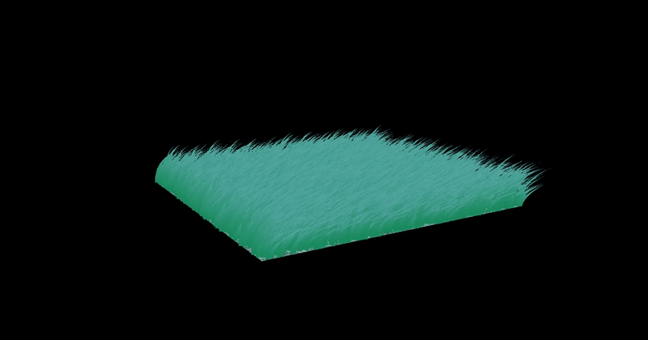
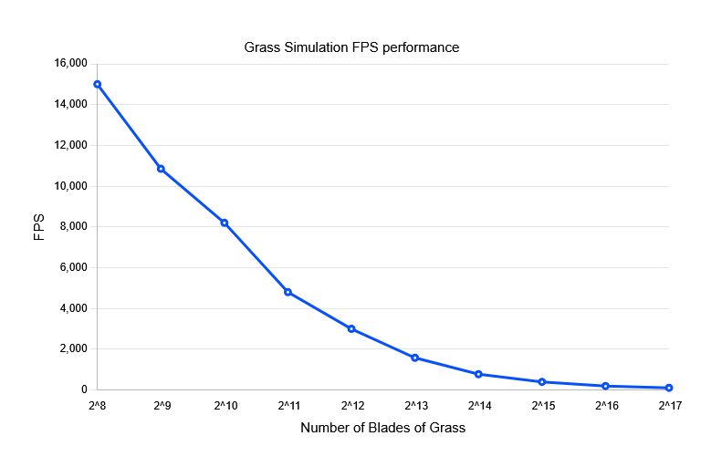

Vulkan Grass Rendering
==================================

**University of Pennsylvania, CIS 565: GPU Programming and Architecture, Project 5**

* Pavel Peev
* Tested on: Windows 11, Intel Core Ultra 5 225f @ 3.3GHz, NVIDIA GeForce RTX 5060

### Description
This project the paper [Responsive Real-Time Grass Rendering for General 3D Scenes](https://www.cg.tuwien.ac.at/research/publications/2017/JAHRMANN-2017-RRTG/JAHRMANN-2017-RRTG-draft.pdf) using Vulkan.

In the paper, the blades of grass are represented as 3 point cubic Bezier curves, upon which forces are applied on. The first control point of the bezier curve represents the base of the blade of grass, and is unmoving. The third control point in the bezier curve represents the tip of the grass blade, and has three forces applied to it: gravity, recovery, and wind. Finally, the second control point helps keep the blade of grass at a constant height.

We run a compute pipeline to calculate the forces and new positions of the second and third control points. During this stage, we also calculate which blades of grass can be culled with 3 culling operation: orientation, view-frustrum, and distance based culling.

Afterwards, the control points are sent to the graphics pipeline with a tesselation shader, which tesselates a quad and uses the uv positions of the points on the quad to align them to the bezier curve in a shape of our choosing (in our case, a triangular tipped rectangle). Upon completion of the tesselation, the new geometry is sent to the fragment shader to be rendered.

## Images

### Grass No Force

### Grass No Wind

### Grass with Wind

### Grass with Wind

### Grass Culling

## Performance Analysis

The above data is done without culling. As the number of blades increases exponentially, we see the fps half. This shows that the grass simulation is very parralel, only increasing in cost logarithmically alongside the exponential increase in the amount of grass we need to render. For a grass simulation, the performance is alright, but for large scale simulations of entire environments with potentially millions or billions of grass blades, it requires other optimizations to run smoothly, such as the culling.

### Culling Performance

Number of Blades: 131072 (2^17)

| Base | Orientation | Orientation Optimal|
|---|---|---|
| 110 fps | 140 fps| 200 fps|

| Base | View-Frustrum | View-Frustrum Optimal |
|---|---|---|
| 110 fps | 150 fps| 300 fps |

| Base | Distance | Distance Optimal |
|---|---|---|
| 110 fps | 250 fps| 750 fps |

| Base | All Culling | All Culling Optimal |
|---|---|---|
| 110 fps | 300 fps| 1000 fps |

For each of the optimal measurements, we position the camera such that they can more effectively cull. For the orientation culling, we position in a spot where more grass is perpendicular to the camera. For view frustrum culling, we look at it from above and zoomed in at a patch of grass. For distance, we zoom out a lot so that about half the patches of grass are culled fully.

We see notable improvements with each of the different culling methods, with the first two giving a marginal 1.5 times performance boost generally and with the potential to double or triple performance in more specific situations. Distance seems to be the most effective, although this one is of course the most visible, as it can reduces . Of course, all 3 together provides the best performance boost, though it's important to note that it's not additive, as there is a bit of overlap between the different culling methods.

